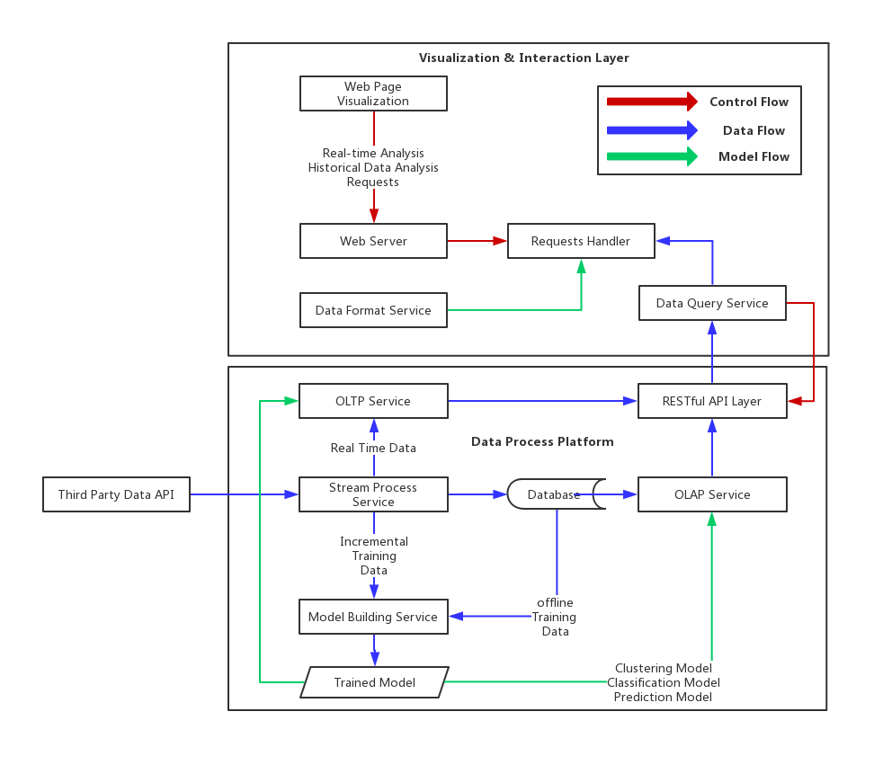
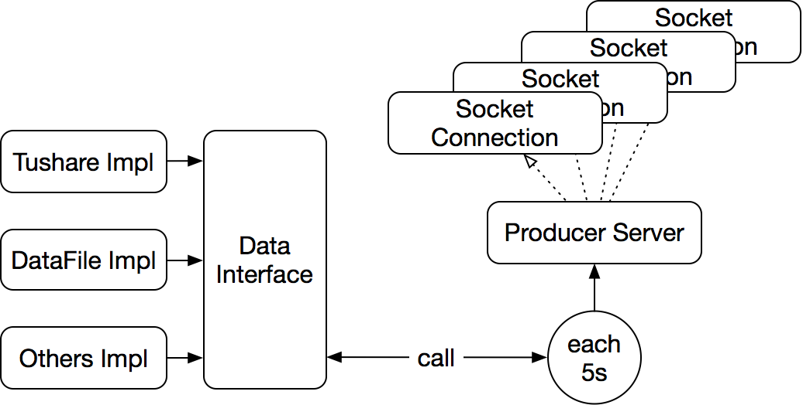
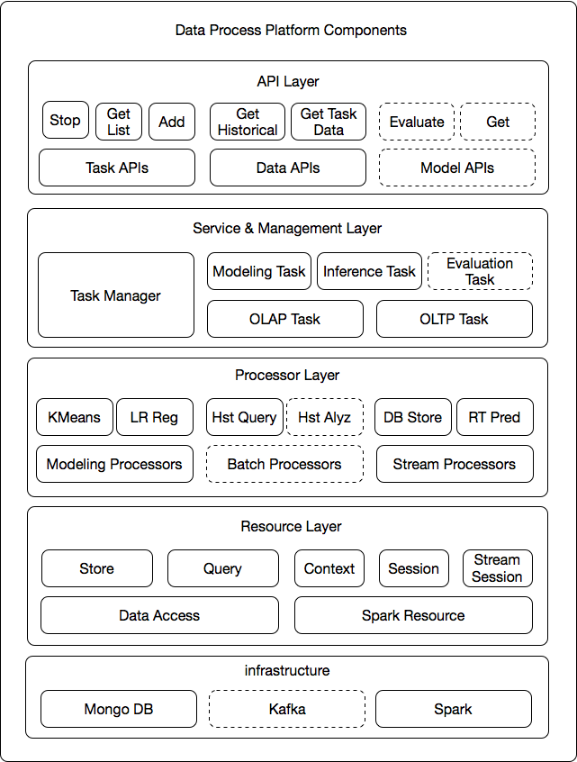
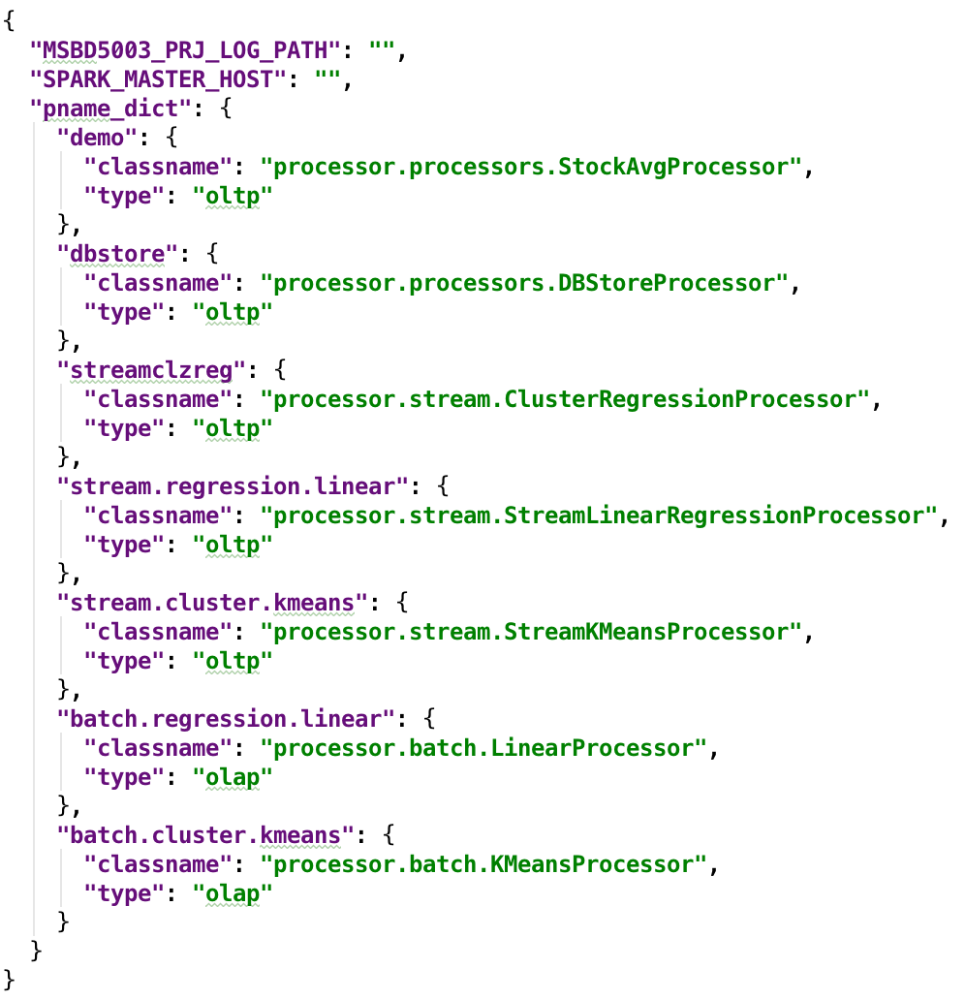
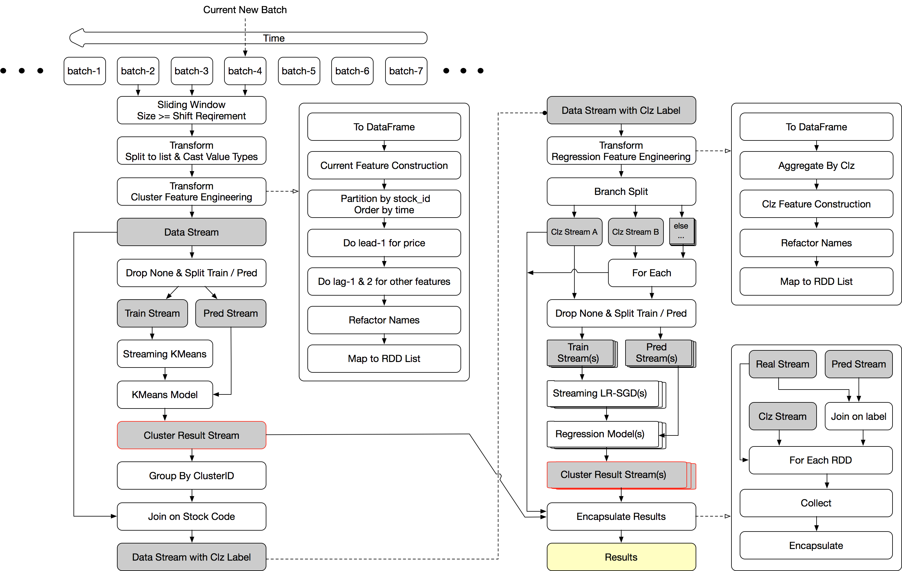
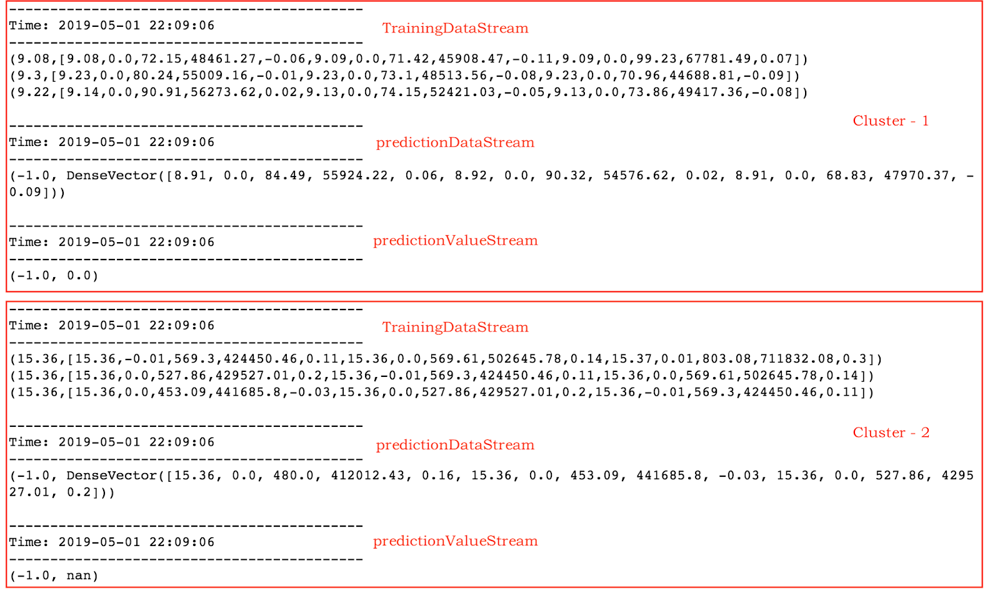
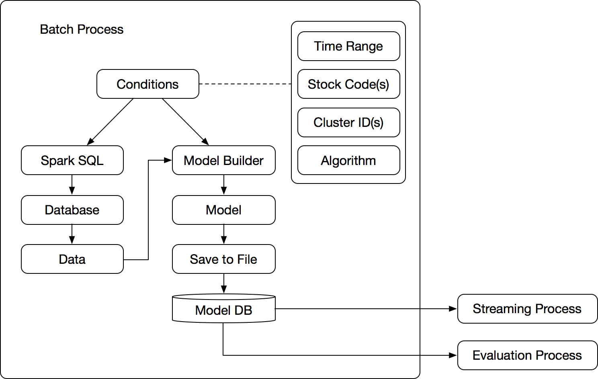
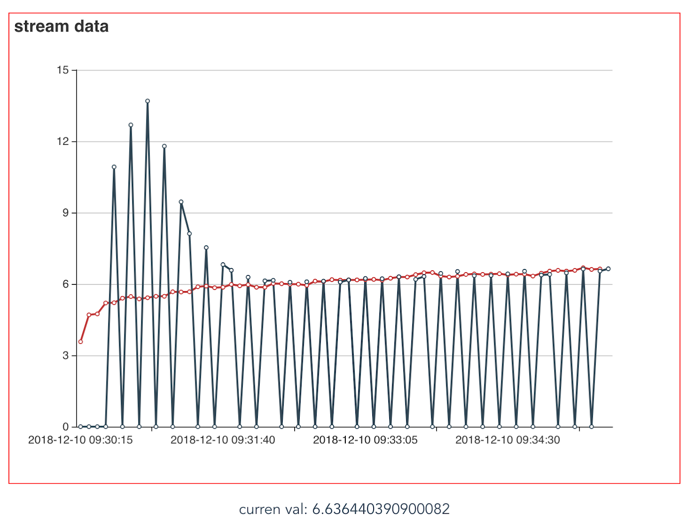

# real-time-stock-analysis-platform

msbd5003 group project.
#### Attention for submission

* Please **DO NOT** submit large data file to ./data, although you can modify ./data/test_data.csv
* Please **DO NOT** submit files in ./code/website/node_modules
* The two folders mentioned above have been add to .gitignore.
  - If you want to share data files, please use wechat or other method.
  - If you need to run the website app. Please follow the README.md instruction in corresponding module folder (run `npm install` first).

#### Next Step

* Enrich the API & implementation
* Implement build_context & run scripts.

# About Project

In recent years, increasing numbers of projects in stock market are conducted by big data technology. With the complex features, large volume of data as well as the real-time fluctuating price, and many other influential factors, in order to handle the task efficiently, big data technologies should be applied. Such platform can help organizations and individuals to having a better understanding of the stock market and making correct decisions in different situations.

We plan to do a wide project which aims to build_context a real-time stock clustering and prediction platform. In this platform, stock data (with indicators including code, name, changing ratio, trade, open, high, low,volumeandsoon)willbeuploadedeverysecond,sothesystem need to process the data in real time. In terms of clustering, the system will divide the stocks into groups based on their similarities. This will help users have a better understanding of the inner relationship between different stocks.Real-time Stock Clustering and Prediction

## File Structure

|  directory | description  |
|:-:|:-:|
| bin | startup scripts. |
| code | project code |
| docs | documentation |
| data | data folder for collection module |
| config | configuration files for runtime. |
| install | installation scripts & relative configurations |

## System Requirements

* Linux / MacOS
* Python 3.6
* Hadoop 2.7.7
* Spark 2.4.0

## Techniques Involoved

* Spark Streaming / MLlib
* MongoDB
* Flask
* vue.js + bootstrap (+ deployd)

## System Architecture



In this project, we used several techniques in different layers to achieve the functions. As the flow graph shows, there are mainly three layers in our design: Data API Layer, Data Process Platform and Visualization & Interaction Layer. The data API layer is a wrapper of third party APIs to make our system compatible with multiple data sources. In this part, we will design a uniformed data structure as the input for the whole system. Some basic python packages such as pandas, numpy will be used here.

The second layer which is the most important part of the system is Data Process Platform. It consists of multiple services with and supports the fundamental functions of the system such as stream and batch data analysis. From the users perspective, OLAP and OLTP meet two data analysis demands. We can handle these two different tasks by using Spark Streaming and Spark SQL, which can provide a satisfying performance on the clustering process. Since this is a distributed system, we may use Apache Kafka to do distribute the streaming messages. Furthermore, we use MongoDB as the database to support the OLAP business, as it is open-sourced and well designed for big data processing. In the bottom of this layer, the clustering, classification and regression algorithms will be driven by Spark MLlib which support distributed training. Moreover, we may use streaming linear regression and streaming k-means algorithm to support the OLTP business. The whole layer will encapsulated by Flask so as to provide REST APIs to the other modules.

And on the top is the visualization and interaction layer, it is a simple B/S architecture App which support the top business level. It will use tools such as E-Chart as visualization component, since E-Chart provide a good animation effects as well as simplest graph data format. For this project, the back-end of the app is integrated with the Data Process Platform to handle business service such as graph format and query request. The front-end uses Vue.js as it is lightweight with powerful template and suitable for quick development. 

Next, we will introduce each part one by one.

## Data Producer




Firstly, the data producer should be compatible with different datasource, and output a data stream as an uniformed format. In this project, since our data is coming from tushare API, to prevent being blocked for calling too frequent, we have downloaded some of the data for testing. Therefore, we also have an data file implementation to mimic the streaming data. And We set the data interval as 5s. Once a socket connection is setup, the producer will keep throwing current data of all stocks to the receiver until the connection was shutdown. This producer is simply acquire data in each iteration and transform data to a uniformed CSV format string. The details of headers are described in the feature part.

## Data Process Platform

### Components



For the core part of the system, the data process platform consists of many modules for different layers and functions. There are 5 layers from the top to the bottom: API, Service, Processor, Resource and Infrastructure. For now, the platform was built based on the MongoDB and Spark, which provide data storage and computation ability. However, we hope to use Kafka as well to handle the streaming data cache, which can insure the stream processing window is correct. The resource layer will manage of connections and interactions with lower level. It basically contains 2 parts, Data Access and Spark Resource. Data Access module is the module for communicate with database and also it will manage the database connection pool. The Spark Resource module will in charge of the management of spark context related resources. And it is implement as a base class for higher processor layer modules to inherit. One layer above, the processor layer implements the basic unit of algorithms in the system such as modeling, streaming & batch data operations. This layer is the most important layer, because most business related code will be written as processors such as K-Means, Linear Regression processor and DB Store, Real-time prediction processor. Next, the service layer focus on the task management of the system. One task consists of multiple processors, and it is a single process in Linux OS. The Task Manager will keep tracking and communicate with these tasks to monitor the progress, status as well as acquire result data. Finally, on the top level are the APIs provide to outside, which covers task, model and data operations for users. The API is formatted as follow.

```
http://localhost:5000/demo
http://localhost:5000/stop_oltp_processor?pid=&pname=
http://localhost:5000/get_curr_oltp_result?pid=&pname=
http://localhost:5000/add_task?&pname=
```

The modules with dotted line means not implemented yet. And some of the features are still under development. Next we will introduce the some of the core parts in the platform. Task Manager & Stream Processor. The former one support the basic back-end framework. And the latter one gives a extendable stock data analysis algorithm and solution of current system.

### Task Manager

As mentioned above, the task manager will in charge of task management. The lifecycle of a task have 6 status or stages: Initial, Started, Running, Finished, Stopped, Terminated. Firstly, initial status means a task instance has been created. When the process was started, this task turns to stated stage. And during this stage, this task will create instances of the processors using reflection mechanism, which can create an instance of a class using the classpath string rather than explicit import and declaration of the class name keyword. Such kind of implementation give the system great ability to easily integrate the processors and the encapsulate tasks as well. Moreover, as each processor inherit a class named Sparkresource, it will then try to build or acquire the spark context, spark session as well as spark stream session in the next move. When this was done, the task turns to running stage and start execute the processor code complete the business functions. However, there are some difference in the end stage for different tasks. For OLAP task, it is a batch operation and the worker process can terminate itself automatically once the task was over and turns to Finished status. On the contrast, we treat the OLTP task as streaming operation and it will keep running until the admin user stop the task. In that case, such OLTP tasks become to Stopped status. Furthermore, when there are error or exceptions occurs, the task will be terminated automatically and marked as Terminated status which is a abnormal status.


This graph illustrate how the APIs interact with Task Manager to create or stop a task and acquire the data generated in time. When user add an Task, the system will initial a task instance running as a single process on OS. Such task process has two threads. One is to listening to the communication commands from the task manager. The internal commands include require process status, process progress heartbeat and data request. Another thread is the actual job executor to handle the batch or stream jobs. The calculation results will be stored in the local cache of the task process. When a data request coming, the task manager can retrieve the newest data from the process cache through internal command.

#### Configuration Files



The configuration file of the data process platform is simple. The main structure is processor name dictionary. Each processor contains its classpath and type. To Integrate a new algorithm is just simply implement the processor interface and then update the pname_dict attribute with API name, classname and process type without shutdown the system.

### Stream Process

#### General Process


Now, let's look at the detail of the Streaming Process. In general, our process can be described as following 3 stages: clustering, aggregation and then regression. For each interval (5 seconds), we apply this process on the input stock data. The final output is the prediction on the stock price of each cluster. The reason to do so, is that we believe stocks even belongs to different industry may have strong hidden influential factors on each other, thus by doing the regression on stock clusters could be more representative and helpful for other processing. Although there are many candidate algorithms for each stage, to reduce the computational cost and the complexity, we use Streaming KMeans & Streaming LinearRegressionWithSGD to do the clustering and regression respectively. Besides, the aggregation for now takes average on most of the features. Moreover, since in fincial field, interpretable model is general more prefered than complex models. Therefore, these simple alogrithms are sufficient to support our system well.

#### Details



This flow chart gives the detail about the complete streaming process procedures. As data keep comming, the Spark Stream process the comming data in small batches for each interval window. In our implementation, we use sliding window to process data in each interval. The reason is that we need to use the previous data to build current features, and future data to build current label. For example, the stock data is a time series, in order to do the clustering or regression, the features that important are not only those indicators at current time point, but also the changes along with the time passing by. Moreover, the ratio as well as the comparing length are vital for feature constraction. Therefore, we need previous data combine with newest data to build the features.

As the coming data is originally simple string format, the first transformation will split each value to list structure with casting value to double or timestamp type. Then the next transformation can do the feature engineering. Due to the Structured Streaming is still on experimental stage, we decide to not use it. Instead, to take advantage of DataFrame operations, we call rdd.toDF in the feature engineering transformation to build features. As mentioned before, the feature engineering part include at least 3 shifting operation and several column operations. The shift operations are conducted by lead and lag APIs. To ensure the shiftting is well done, the data need to be partitioned by stock ID with ascending time order. So that, the shifting can be restrict to each stock itself. Finally, we take the RDD out of the DataFrame and then map the row type to more general list format and output for further process.

Since the machine learning algorithms in Spark MLlib uses separate APIs for training and prediction (and they require different formatted streams), we split the stream to 2 branches, one for training the model, another for the inference of current stocks' cluster. The Steaming KMeans takes traning stream as input, and output a KMeans Model. Then we store this model in local cache and give the prediction streaming as input to it. Then we get the current cluster result for the stocks. The result is a key-value pair DStream, which uses stock code as key and cluster ID as value but with no features anymore. Thus, A join operation with original feature of each stocks is necessary for futher aggreate process. 

After join the data and cluster label together and aggregate the stocks in the same cluster, we have a K new DStreams ready for regression. From the code structure aspect, the following procedures are similar to above, except that we'll assign each cluster a regression model to do the prediction. As you the graph shows the items in the right bottom corner are mostly stack squares which represent multiple objects or operations. Similiar to the previous, regression stage will use DataFrame transformation, split operation , traning and inference operations to get K final DStream of each cluster and K linear model which will also be cached and incrementally trained in following intervals. (Here K is the cluster number)



Here shows intermediate DStreams in regression stage. The red box separate 2 clusters, and each cluster have their own training DStream, prediction DStream as well as the result DStream. For now, we set the window as 3 times of the batch length, and the sliding interval as 1 batch length, which means, for each output, the models will be incrementally trained with previous 3 data points, and the prediction of next future time point will based on current data and features. In the training data stream, the key (or label) is the stock price of next time point, and the values are current and previous indicators include prices and others features. In the prediction data stream, the label is setted as -1 by default and the values are features of current time. The prediction result is also a key value pair, with label fixed as -1 and the value as the result result which represent the predict price of next time point.

Finally, we encapsulate the current price, predicted future price and cluster result to a single structure and store it in the process cache. This structure use timestamp as key. And the value is also a dictionary with real and prediction key-value paires. The cluster result is stored as the cluster ID to its amount of stocks for now. 

### Batch Process



About the Batch Processing, due to the time limitation, we didn't finished this part yet. When it was done, we hope it works as the design shows, to using more complex, advanced, offline-trained models to support the real-time inference and evaluation functions.

As the batch process is carried out in off-line mode, that means users are willing to give more time to execuate the analysis program. With some configurations of time range, stock codes or cluster IDs and algorithm, we can build some more advanced models using more data stored in the database. Moreover, we can also include some auto parameter tune mechanism for better performace of the model selection. These models will be stored in local disk and users can choose one or several to do the real-time inference to exam their performance or apply them to support their market decisions.

## Problems & Improvements



Because this is quite a big system, there are still many problems to solve. Both of the data processing speed and prediction accuracy are important for system performance.

Firstly, from the aspect of data processing speed, as the graph shows, the red line is the real trend while the black is the prediction. There are many missing points on the prediction value, and it appears regularly. This happens when the processing speed cannot catch up the coming data, and then spark streaming will automatically include all comming data into the next batch window to process, which will cause some points already have the real value and no need to do the prediction. And finally result in the jump on prediction value. To solve this, one solution is add more cores for the processing, as the data is quite separate, the parallel effciency should be higher enough to support the speed up. Another solution is by using Kafka as data caching module. However, the later one may result in to delay on prediction. As the inference speed is vital for such real-time implementation, the latter one may not be a effective second solution for the problem.

Secondly, from the prediction accuracy aspect, we can see from the graph. The first 3 predictions are all 0 which means it still under the feasture constraction stage and current data is not enough to support for model building. After that, we got the first several values of the initial prediction. As same as our expectation, the first several round have huge error, which also make sense since the model will keep improve itself with newer comming data. The error drops significantly after around 1.5 minutes which is 15 windows. The following prediction result keeps tracking the real value. And also since this is a prediction, the newest prediction always one step head of the real price.

Such result is quite satisfying and reasonable. Actually, on the one hand in most of the time, the stock price in such fine-grained granularity shoule be stable which will greatly reduce the difficulty of the prediction. On the other hand, because of the stable fact, even small error of the predicted price lead to relatively higher risk in the trading, since it is the rise or fall of a stock that decide wether one can make money rather than the predict error.

In conclusion, we think there are still many works to do for both model testing and feature engineering before put the system in production. 


## Reference

* For front-end app fast development: [vue.js](https://vuejs.org)
* For front-end app, web page components: [Bootstrap](https://getbootstrap.com/docs/4.3/examples/)
* For API Building (just for reference): [Deployd](http://deployd.com/)
